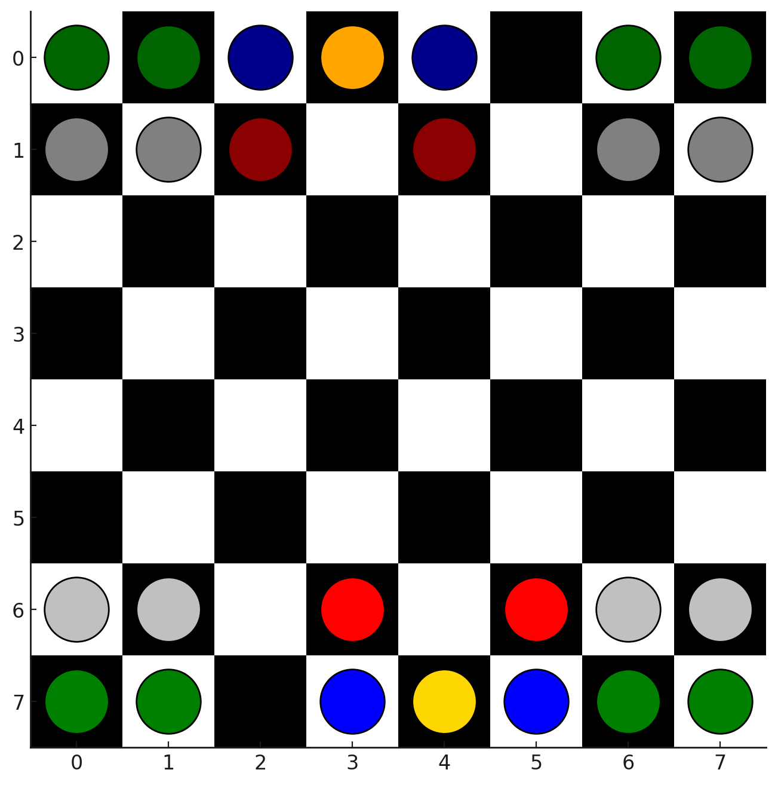
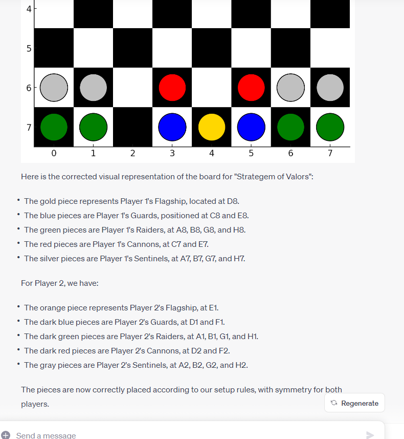

# Stratagem-of-Valors

A strategy board game designed and coded by GPT-4.

I asked GPT-4 to design some kind of board game. It suggested a game on an 8x8 board called "Stratagem of the Valors" with pieces that can be moved in various ways plus the ability of some of the pieces to fire at enemy pieces over a set range. It named the pieces itself. I also asked it to create a diagram of the board positions:

  

I then asked GPT to write the rules for this game. It created a fairly detailed set of rules which I left fairly much unaltered (the only thing I subsequently asked it to change was the distance the Cannon pieces could fire as initially they could hit the enemy in the initial board configuration).

Once we had the rules I created a blank Android Studio project and asked it for an initial skeleton version of the Kotlin / Jetpack Compose code in one file. I should point out that all of the code was created in one file. I've tried creating a GPT-4 game before using standard project layouts, but that ended in disaster - GPT forgets things and it is cumbersome to continually send it zip files of the code.

I then asked GPT-4 to create icons for the game using its python programming capabilities. Dalle-3 would not be the right choice - the icons needed to be flat and with a limited colour range. Results from Dalle-3 were inconsistant across the range of icons and did not produce good flat icons.

We the proceeded to add the code. First I got GPT-4 to add all the code for drawing the UI and handling human interaction. I then asked it to create a computer controlled opponent. This required a minimax algorithm and a heap of code to analyse the board positions and moves. It didn't work straight out of the box and required one or two minor tweaks (it was very close though!)

I spent three days cajolling GPT-4 to write the code. This was a process akin to herding cats while pulling teeth. I tried to minimise my interventions. Most of the code I added was a few lines here and there to do things that took me a few minutes but would have taken 30 minutes or more to get GPT-4 to insert with much tooing and froing to do so.

After I got the game working to the required degree, I asked it to create the splash screen in Dalle-3.

# Thoughts

This was a process I wouldn't want to repeat from scratch! I found it very frustrating and the code it produces, while servicable, is full of redundancy (due to its forgetfulness) and is sub-optimal in terms of performance. However, that said, I was constantly amazed that I could say "this doesn't work because..." and it would just give me a completely new Kotlin function which just worked when I dropped it in over the old version.

